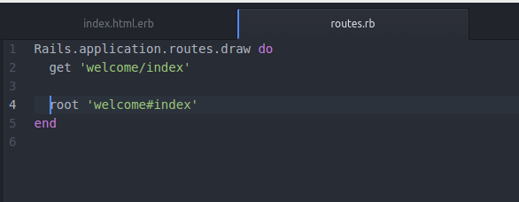
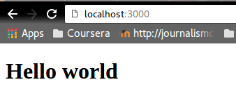

# Primer round

Para este primer round hice una simple aplicación de RoR que dijera *Hello World* en el home. Que para este caso es localhost:3000

Los pasos son los siguientes:

1. Tener instalado Rails, para lo cual recomiendo [esta guía](http://guides.rubyonrails.org/getting_started.html).
2. Crear una aplicación. En la guía vienen también las instrucciones, pero básicamente es desde la terminal: `rails new nombreDelApp`. Esto crea un directorio y todos los fólders adentro para crear una aplicación. A partir de aquí, vale la pena prender el servidor local de rails con `bin/rails server`. Visita localhost:3000 en tu navegador para recibir la pantalla de bienvenida a Rails.
3. Luego hay que crear un controlador simple para el *Hello World*. Más abajo hablo de los controladores, pero por ahora hay que crear este, con el comando `bin/ generate rails controller Welcome index` esta línea de código habrá creado una serie de archivos y una ruta con lo que estaremos trabajando.
4. Entra a app/views/welcome/index.html.rb este archivo fue de los recién creados por tu controlador. Ahí borras todo y pones un simple *Hello World*.
5. Rails sigue pensando que tu página de inicio no es esta. Para cambiar tu página de inicio, debes ir a config/routes.rb y agregar la línea `root welcome#index` antes del end. 

Vualá.

Algunas reflexiones:
- Lo bonito es que Rails (Ruby?) es un lenguaje limpio. O eso parece.
- La explicación que ofrece la guía de Rails sobre el modelo vista-controlador es rala. Sé que después voy a tener que leer más al respecto, pero para este round fue suficiente.
- Es overwhelming la cantidad de folders, archivos y movimientos que debes hacer para tirar un simple Hello World, pero quiero creer que esto se traduce en facilidad para aplicaciones más complicadas.
