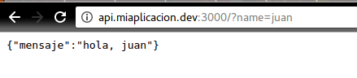
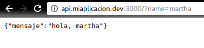
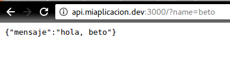
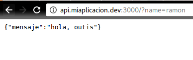

# Haz que cuando entres a api.miaplicacion.dev/?name=juan te regrese un json que diga { mensaje: "hola juan" }

## Y así con varios campos de name. Para puntos extra, si el nombre es ramón, tienes que regresar como mensaje "hola outis"

Para este ejercicio descompuse el problema en varias partes.

1. Que exista un tipo dato que se llame :name (en rails, se le llama parámetros)
2. Que tome ese parámetro a través del URL
3. Despliega ese parámetro en el json junto con el Hola

De acuerdo a [este video](https://youtu.be/Cuo24KgP-OM?t=55) del minuto :55 al 1:44 en el URL que queremos construir :name es un parámetro del controlador API, y 'Juan' sería el dato. Rails gracias a su ruteo, es capáz de tomar estos datos a través del URL siempre y cuando hayamos definido el parámetro.

Con ayuda de ese video lo que hicimos fue, en `nombredelapp/app/controllers/api_controller.rb` usar el siguiente código:

```
def index
  render json: { mensaje: "hola " + params[:name]}
end
```

Y en el URL escribir `api.miaplicacion.dev/?name=juan` lo que dio como resultado:



Como `params[:name]` es dinámico, lo que le pongas al final de `?name=` dará como resultado "hola, " y el nombre que pusiste en el URL. Ejemplos:






La segunda parte (¡para puntos extra!) era que si el url era `?name=ramon` el mensaje dijera "hola, outis", esto lo logramos con un sencillo if/else en el controlador:

```
def index
    if params[:name] == "ramon"
      render json: { mensaje: "hola, outis"}
    else
      render json: { mensaje: "hola, " + params[:name]}
    end
end

```

Lo que da como resultado:

 
