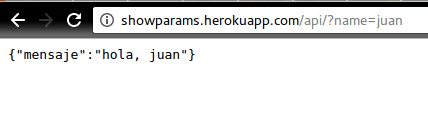

# Sube el app a heroku

Hacer este ejercicio tiene más complejidad de lo que parece, pues no sólo es hacer el deployment a Heroku, como veremos a continuación.  

Primero que nada, explico que heroku es un servicio de computación en la nube donde puedes hostear tus aplicaciones. Heroku ofrece una capa gratuita para necesidades muy básicas, lo que lo hace muy popular para subir una muestra de tu trabajo.

Para hacer deployment a heroku usando git (mi método favorito), hay que seguir [esta guía](https://devcenter.heroku.com/articles/git).

Únicamente me topé con este problema:

```
remote:  !     Failed to install gems via Bundler.
remote:  !     
remote:  !     Detected sqlite3 gem which is not supported on Heroku.
remote:  !     https://devcenter.heroku.com/articles/sqlite3
remote:  !
remote:  !     Push rejected, failed to compile Ruby app.
remote:
remote:  !     Push failed
```

Esto es porque heroku sólo soporta bases de datos PostgreSQL por [buenas razones que vale leer](https://devcenter.heroku.com/articles/sqlite3).

Lo que hay que hacer, pues, es quitar la gema de sqlite3. El procedimiento lo deduje de [las respuestas en este artículo](http://stackoverflow.com/questions/21297160/detected-sqlite3-gem-which-is-not-supported-on-heroku) y por ensayo y error, y es el siguiente.

1. Entra a la `Gemfile` y comenta con un # la línea que dice `gem sqlite3`.
2. En la terminal, asegúrate de estar en el fólder del proyecto y corre `bundle install`. Lo que esto hace es actualizar todas las instalaciones de gemas que hay en tu Gemfile.
3. Hay que modificar el database.yml file, [instrucciones aquí](https://devcenter.heroku.com/articles/getting-started-with-rails5#database).
4. Escogimos hacer deploymento por git, así que hay que commitear los cambios. Si le das `git status` en la misma terminal (buena práctica forever) te darás cuenta que se actualizaron tanto la Gemfile como Gemfile.lock. Agrega ambos con `git add Gemfile Gemfile.lock`.
5. Haz un `git commit` y escribe un mensaje detallando qué cambios hiciste en las gemas y que corriste bundle install.
6. En la terminal es hora de empujar a heroku, haz `git push heroku master`
7. profit. Tu app está arriba.


*Antes de iniciar este procedimiento asegúrate que tienes instalado postgresql. [Yo usé este tutorial.](https://www.digitalocean.com/community/tutorials/how-to-install-and-use-postgresql-on-ubuntu-16-04) *

```
remote: -----> Compressing...
remote:        Done: 26.8M
remote: -----> Launching...
remote:        Released v5
remote:        https://nombredetuapp.herokuapp.com/ deployed to Heroku
remote:
remote: Verifying deploy... done.
To https://git.heroku.com/urlparams.git
 * [new branch]      master -> master
```

A mí este método me trajo varios problemas con la existencia de la BD, por lo que decidí hacer una app de cero. Usé el procedimiento [descrito aquí](https://devcenter.heroku.com/articles/getting-started-with-rails5).

El resultado fue este:  



Desafortunadamente, heroku no soporta subdominios nativos para tus apps, a menos que tengas un dominio externo y apuntes el DNS. [Link 1](http://stackoverflow.com/questions/17994288/subdomain-with-rails-and-herokuapp) [Link 2](http://stackoverflow.com/questions/14082029/how-to-create-a-subsubdomain-for-an-app-on-heroku-e-g-sub-myapp-herokuapp-com)

El app puede ser consultada en http://showparams.herokuapp.com.
