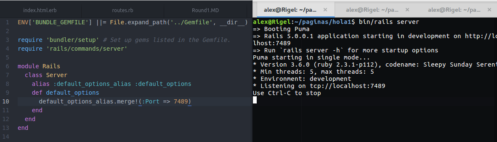
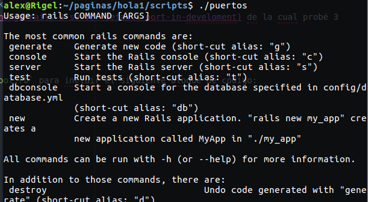
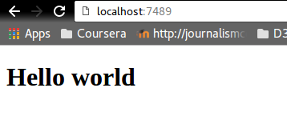

# Round 2
### _Hello world en puerto no-default_

La misión era abrir un **Hello World** en un puerto que no fuera el default 3000. En este caso el 7489.

La fuente principal para esta tarea es [esta pregunta de Stack Overflow](http://stackoverflow.com/questions/3842818/how-to-change-rails-3-server-default-port-in-develoment) de la cual probé 2 respuestas.

### Método

1. La que primera que me funcionó, fue modificar el `config/boot.rb` para incluir el siguiente bloque de código:

```ruby
require 'rails/commands/server'

module Rails
  class Server
    alias :default_options_alias :default_options
    def default_options
      default_options_alias.merge!(:Port => 7489)
    end    
  end
end
```

Ahí sólo reinicié el servidor y listo.



2. La segunda es hacer un bash script con el siguiente código:
```bash
#!/bin/bash
rails server -p 7849
```

Para esta solución, tuve qué averiguar qué es un bash script y cómo se ejecutan. Para entenderlo encontré [este link](http://www.howtogeek.com/67469/the-beginners-guide-to-shell-scripting-the-basics/). En este caso, el script lo hice dentro de una carpeta scripts que creé adentro del proyecto y lo ejecuté con `./nombredelscript` y funcionó perfectamente.



### Veredicto

Prefiero la primera solución. De ese modo nadie tiene que acordarse de correr los scripts, sino que está embebido en el código.

