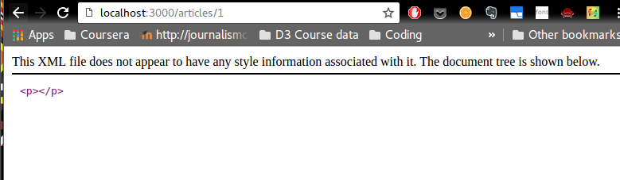
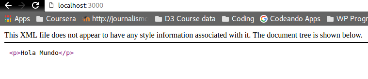
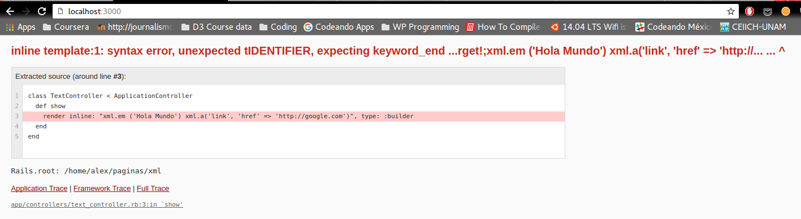

# Rendereando un xml

De nuevo trabajando con [Layouts and Rendering](http://guides.rubyonrails.org/layouts_and_rendering.html) la misión es renderear un texto como xml.

Siguiendo el aprendizaje anterior, usamos el siguiente código, como dice en 2.2.5 de layouts_and_rendering.

```  
def show
    render inline: "xml.p {'Hola Mundo'}", type: :builder
end
  ```
Pero el resultado fue un xml vacío:



Encontré la respuesta en el 3.1.2 de [Action View Overview](http://guides.rubyonrails.org/action_view_overview.html) El error está en el formateo del xml. No son curly braces, sino paréntesis:

```
class TextController < ApplicationController
  def show
    render inline: "xml.p ('Hola Mundo')", type: :builder
  end
end
```



¿Por qué la guía de rails me mandaría a ponerle curly braces? No sé. Para burlarse de los n00bs. En fin. Traté de agregar más de una línea de XML al controller pero fallé miserablemente. El código:

```class TextController < ApplicationController
  def show
    render inline: "xml.em ('Hola Mundo') xml.a('link', 'href' => 'http://google.com')", type: :builder
  end
end
```

El error:



Aún así, no creo que modificar el controlador para mostrar el XML sea para ninguna otra cosa más que para testeo. Finalmente decidí renderear algo de texto formateado en XML directo en el view, que creo que es la aplicación más sensata de este ejercicio. El controlador quedó así:

```def show
end
```

Cambié la extensión de la vista a .html.builder y el código de ña vista quedó así:

```
xml.em("emphasized")
xml.em { xml.b("emph & bold") }
xml.a("A Link", "href" => "http://rubyonrails.org")
xml.target("name" => "compile", "option" => "fast")
```
la página quedó así:


