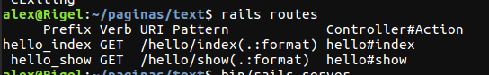
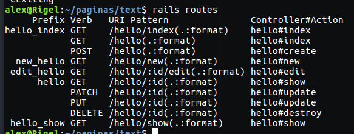
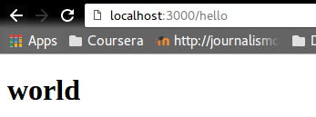

# Entra a localhost:3000/hello y regresa un html que diga world

Lo primero que hice fue crear una nueva app `rails new nombredelapp` y un controlador index llamado hello `rails generate controller hello`. Luego modificar el index.html.erb en el nombredelapp/app/views/hello para que dijera `<h1>world</h1>`. Me dió el siguiente error:


Cuando en la terminal busqué las rutas, salió esto:




Gracias de nuevo al 2.1 de [Layouts and rendering](http://guides.rubyonrails.org/layouts_and_rendering.html) vi que el error era no haber especificado un recurso en el archivo config/routes.rb. ¿Por qué no pensé que fuera a ser necesario? porque creí que los recursos sólo se referían a tablas en la base de datos. Por lo visto me equivoqué. Así que agregué el siguiente código en el config/routes.rb:

```
Rails.application.routes.draw do
  get 'hello/index'
    resources :hello
  end
```

Y ahora, al explorar `rails routes`en la terminal me daba lo siguiente:



Y el resutlado fue:


