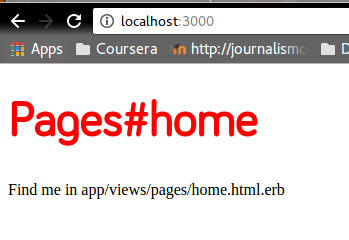
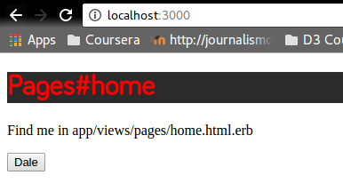
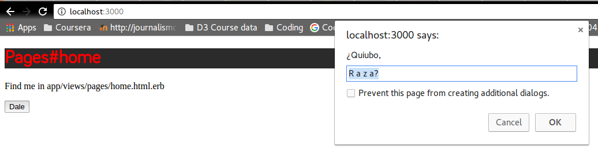
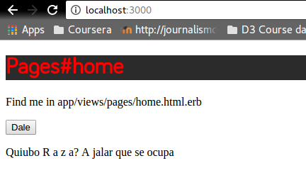

# Métele CSS y JS al html

Para meter CSS meramenta aproveché la herramienta que ya ofrece rails llamada "Asset pipeline". Genera un CSS automáticamente linkeado a las hojas generadas que se encuentra en `nombredelapp/app/assets/stylesheets/nombredelcontrolador.scss`:

Aquí sólo anoté el CSS relevante y listo.



Para meter JS, del mismo modo, Rails provee dentro de su Asset pipeline un archivo de js relevante a cada contorlador, en este caso `nombredelapp/app/assets/javascripts/nombredelcontrolador.js` en el cual puedes escribir el código de javascript relevante a ese controlador. En mi caso el código fue el siguiente:

```

function myFunction() {
    var person = prompt("¿Quiubo,", "R a z a?");

    if (person != null) {
        document.getElementById("demo").innerHTML =
        "Quiubo " + person + " A jalar que se ocupa";
    }
}

```

Ya sólo en la página dónde quieres que aparezca el código mandas llamar el script, en mi caso de esta manera:

```
<button onclick="myFunction()">Dale</button>

<p id="demo"></p>

<script src="/app/assets/javascripts/pages.js" charset="utf-8"></script>
```

Los resultados son estos:








La  mayoría de lo aprendido fue de [Layouts and rendering sección 3](http://guides.rubyonrails.org/layouts_and_rendering.html), la introducción a [Asset Pipeline](http://guides.rubyonrails.org/asset_pipeline.html) y [este video de youtube](https://www.youtube.com/watch?v=CEShEfJS81A).

Bonus: [Cómo usar Bootstrap con Rails](https://www.youtube.com/watch?v=v002f5-9hx8) 
