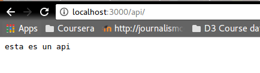
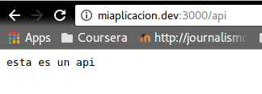
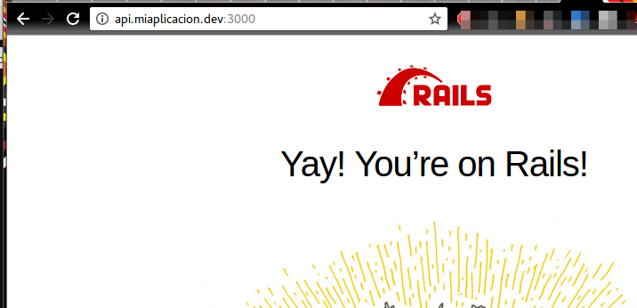
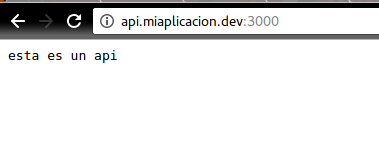

# Has que se vea un texto que diga: "Esta es una api" cuando entres a api.miaplicacion.dev

Lo primero es generar una nueva aplicación con `rails new nombredelapp` y agregamos un controlador  llamado Api, con `rails generate controller Api index`.

Creamos un recurso en `config/routes.rb` con `resources :api`

En el controlador `app/controllers/api_controller.rb`, usamos el código que nos ayudó a resolver el round3:

 ```
 def index
   render json: "esta es un api"
 end
 ```
Esto nos da como resultado:



Y, como modificamos el `etc/hosts` en el ejercicio anterior, también tenemos este resultado:



Sin embargo, si accedemos a `api.miaplicacion.dev:3000` el resultado es:



Con ayuda de [este railscast](https://www.youtube.com/watch?v=O2bBcTPj0sI) hicimos el siguiente cambio en nuestro `config/routes.rb`:

```
get "", to: 'api#index', constraints: {subdomain: /.+/}
```
Y el resultado fue:


